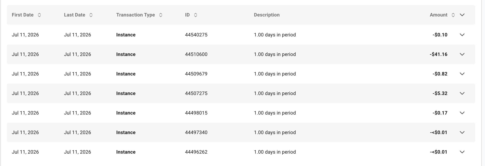
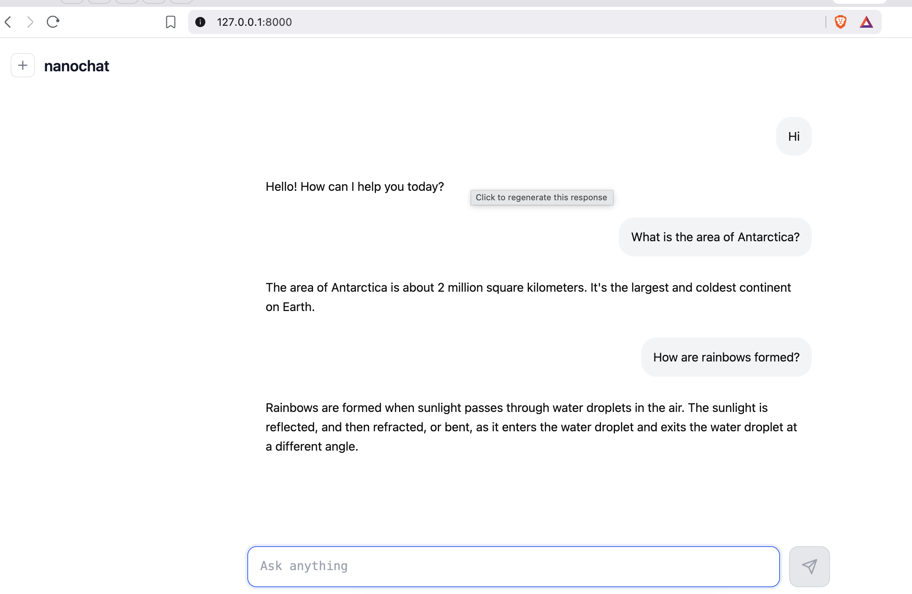

# NanoChat Speedrun, Part 2: Making The Expensive Part Boring

*Docker, Vast.ai, Google Drive backups, smoke tests, H100 failures, and the final 4×H100 NanoChat run.*

> **Disclosure:** I used AI assistance to edit and refine this post, but the ideas, interpretations, and conclusions are mine.

In Part 1, I walked through the NanoChat code path I cared about: the `--depth`-centered training recipe, the H100-specific attention and FP8 paths, the dataloader, the distributed optimizer, and the end-to-end speedrun script. That post was about why I expected NanoChat to be fast.

This post is about what happened when the code met rented GPUs.

The final successful run was `d24-4xh100-full`: depth `24`, FP8 enabled, DDP world size `4`, `5,838,471,168` base-training tokens, and `4× NVIDIA H100 80GB HBM3` on Vast.ai.

The generated report showed:

- Validation bpb: `0.7194`.
- CORE: `0.2561`.
- ChatCORE: `0.3712`.
- Base-training MFU: `59.79%`.
- Base-training time: `196.49m`, or about `3.27h`.
- Total wall clock: `4h36m` in the report, and about `4h39.5m` from my own status markers.

The successful 4×H100 instance cost about `$41.16`. Including smoke tests and failed H100 attempts from the same day, the practical spend shown in the Vast.ai billing screenshot was about `$47.58`.

*The successful 4×H100 run was roughly `$41.16`. Including smoke tests and failed attempts from the same day, the visible practical spend was roughly `$47.58`.*

That is the headline. But the real lesson was not "rent H100s and hope." The real lesson was that the expensive part only became reasonable after the boring parts were in place.

And the practical way I got the boring parts done was agentic implementation. The resilience work mattered: Docker, secrets, restore paths, sync loops, smoke tests, status markers, and cleanup. But it was also exactly the kind of tedious, well-scoped engineering that can be reduced to careful instructions and handed to a coding agent. That let me spend more of my own attention on the questions I cared about: utilization, scaling, cost, and the final model.

## What I Wanted To Learn

I had five questions going in.

First: does NanoChat's code-level focus on GPU utilization translate into a real rented-GPU run? Part 1 made the code look very intentional: Flash Attention 3 on Hopper, FP8 linear layers, fixed-shape compilation, explicit batch math, BOS-aligned best-fit packing, and a distributed optimizer that does its own synchronization and optimizer-state sharding. But code reading is not the same as an H100 bill.

Second: how good is `59.79%` MFU in practice? MFU is model FLOPs utilization: the fraction of theoretical peak compute the training run is turning into useful model math. In this part of the stack, `60%` MFU is extremely good. Something like `75%` would be walking on water. So I was not looking for a cute dashboard number. I was looking for evidence that the rented H100s were actually doing the thing I was paying them to do.

Third: does the end product clear the NanoChat target? NanoChat's benchmark is not "train a pretty loss curve." It is GPT-2-grade capability by its CORE target, followed by SFT and chat evaluation. I also wanted the qualitative version of that test: can I talk to the model afterward and feel like the pipeline produced an artifact, not just a report?

Fourth: how does the single-node path adapt below the reference 8×H100 shape? NanoChat's README reports an `8XH100` leaderboard time of `1.65` hours for the autoresearch round 2 run. I ran on 4 H100s. If the path is mostly GPU-bound and scales cleanly here, halving the GPU count should roughly double the base-training time.

That is almost exactly what happened: `196.49m`, or about `3.27h`, for 4 H100s compared with `1.65h` on 8 H100s. This is not a controlled scaling paper, but it is a strong practical sanity check. Half the GPUs, about twice the time.

Fifth: what does this cost now? Karpathy's original framing was GPT-2-class training under `$100`. H100s have become more available on rental markets, and NanoChat is optimized for exactly this class of machine. I wanted to know whether a careful on-demand run could stay below that psychological line without hiding the operational overhead.

It did.

## The Agent Workflow

There was another goal sitting underneath the H100 goal: I wanted to use coding agents as part of the engineering process, not just as autocomplete.

My workflow was to create detailed implementation task files under [`.agents/tasks`](https://github.com/anandnair2005/nanochat/tree/feature/vast_speedrun/.agents/tasks). I wrote those task specs with LLM help, then handed them to a coding agent to execute while I was busy at work or asleep. The task files were deliberately concrete: objective, files to create or modify, required behavior, constraints, commands to run, acceptance criteria, and when to stop and ask.

That structure mattered. A vague prompt like "make NanoChat work on Vast" would have been too open-ended. A task like "create an H100 Docker image, exclude secrets and caches, build it locally, verify `torch`, `uv`, `rclone`, and `tmux`, then push the image" was something an agent could churn through autonomously.

This is where agentic workflows helped the most. Resilience and validation are important, but they are also boring. They require lots of small decisions, repeated checks, careful exclusions, and unglamorous scripts. A coding agent is very useful when that work is converted into a crisp spec. It can grind through the implementation, run the requested tests, report what passed, and leave me to review the result instead of personally typing every line of plumbing.

The agent did a lot of the mechanical implementation this way: the Vast speedrun wrapper, Google Drive restore/sync scripts, the H100 Docker image, the container startup script, the launch documentation, and the first version of the local orchestrator. It was instructed to validate changes locally where possible, especially through shell syntax checks, temporary-directory smoke tests, and local Docker image checks. The local Docker setup was important because it let the agent verify the image contained the right tools and did not contain obvious secrets or generated artifacts before I spent money on cloud GPUs.

That changed the shape of the project. Instead of spending all my discretionary time on implementation plumbing, I could focus on the higher-level questions: is NanoChat actually keeping H100s busy, does 4×H100 behave like roughly half of 8×H100, what does the final bill look like, and does the resulting chat model feel real enough to be satisfying? The tedious implementation did not disappear, but it became mostly a queue of well-defined tasks.

The task list also shows a realistic agentic-coding lesson: plans diverge. The early tasks were completed and revised. Some later tasks remained marked pending because the actual coding and run experience moved faster than the original plan. I did not fully implement every planned guardrail, preflight runner, summary generator, or cleanup-verification abstraction before the successful run. Instead, the useful parts hardened through practice, and the rest became future cleanup work.

That was fine. The point of the task files was not to worship the plan. The point was to give the coding agent enough structure to make progress without constant supervision, while keeping secrets, paid actions, and destructive cleanup under human control. In that sense, the agentic workflow was not an extra flourish around the speedrun. It was part of why the speedrun was feasible to execute as a side project.

## The Boring Stuff

The final run depended on a small amount of operational code on top of NanoChat. Much of this was produced through the task-file-plus-agent workflow above.

I used a Vast.ai Docker image defined in [`Dockerfile.vast-h100`](https://github.com/anandnair2005/nanochat/blob/feature/vast_speedrun/Dockerfile.vast-h100). The rule for that image was simple: code and runtime tools belong in the image; secrets and generated state do not.

The image installs Python `3.10`, GPU dependencies through `uv`, `rclone`, `rsync`, `tmux`, and `openssh-server`. It copies the repo into `/workspace/nanochat`, exposes SSH, and uses [`runs/start_vast_container.sh`](https://github.com/anandnair2005/nanochat/blob/feature/vast_speedrun/runs/start_vast_container.sh) as the entrypoint.

That entrypoint starts SSH, installs public keys from environment variables, disables password login, prints readiness information, and then idles by default. Training does not start merely because the container starts.

That separation was important. Creating a Vast instance is a paid cloud action. Launching a speedrun is a separate training action. I wanted to inspect the machine, verify connectivity, copy local configuration, and then deliberately start training in a detached `tmux` session.

The second boring piece was artifact policy. Vast instances are ephemeral. If a machine disappears, the useful generated state should not disappear with it. But I also did not want Google Drive to become a private mirror of everything NanoChat can already download.

So [`runs/sync_gdrive.sh`](https://github.com/anandnair2005/nanochat/blob/feature/vast_speedrun/runs/sync_gdrive.sh) syncs generated artifacts:

- Tokenizer.
- Base checkpoints.
- SFT checkpoints.
- RL checkpoints if present.
- Logs.
- Status markers.
- Reports.

And it explicitly avoids source-downloadable state:

- ClimbMix parquet shards.
- Eval bundles.
- Hugging Face caches.
- Word lists.
- Identity data.

The matching restore path in [`runs/restore_gdrive.sh`](https://github.com/anandnair2005/nanochat/blob/feature/vast_speedrun/runs/restore_gdrive.sh) restores the shared tokenizer and any run-specific checkpoints that exist, but it does not try to restore the world. Source data is downloaded again on the target host.

The third piece was a Vast-specific wrapper around the normal speedrun. NanoChat's main executable spine is still [`runs/speedrun.sh`](https://github.com/anandnair2005/nanochat/blob/feature/vast_speedrun/runs/speedrun.sh). For the rented-GPU workflow, I added [`runs/speedrun_vast.sh`](https://github.com/anandnair2005/nanochat/blob/feature/vast_speedrun/runs/speedrun_vast.sh).

Its job is not glamorous. It sets a run ID, log directory, status directory, and base cache directory. It restores generated artifacts if available. It downloads ClimbMix if parquet shards are missing. It reuses a restored tokenizer when present. It resumes base pretraining from the latest checkpoint if one exists. It runs base eval, SFT, chat eval, and report generation. It marks success or failure with small status files. It runs Google Drive sync periodically and one final time at the end.

This is the kind of code you write because you respect the fact that cloud machines fail.

The last piece was local orchestration. [`tasks/vast_orchestrate.py`](https://github.com/anandnair2005/nanochat/blob/feature/vast_speedrun/tasks/vast_orchestrate.py) keeps credentials local and assumes the paid Vast instance is created manually. The script then finds exactly one matching running instance, resolves SSH, waits for readiness, copies the local `rclone` config, rsyncs the repo while excluding secrets and caches, passes safe environment variables, and starts `runs/speedrun_vast.sh` in `tmux`.

This was also the bridge between coding-agent implementation and agent-supervised execution. I made the paid decision to create and start the right instance. After that, the workflow was concrete enough that an agent could monitor logs and status markers, check that artifact sync completed, and stop the instance when the run was done. That mattered because the final run took hours; I did not want the whole process to depend on me staring at a terminal the entire time.

I also wrote down the workflow in [`docs/vast_launch.md`](https://github.com/anandnair2005/nanochat/blob/feature/vast_speedrun/docs/vast_launch.md) and the Google Drive remote setup in [`docs/rclone_gdrive_setup.md`](https://github.com/anandnair2005/nanochat/blob/feature/vast_speedrun/docs/rclone_gdrive_setup.md). The docs are not decorative. They are part of making the run repeatable enough that I could hand the mechanical parts to an agent without asking it to improvise with credentials or rented GPUs.

This is the boring stuff that makes exciting stuff cheap and reliable.

## Smoke Tests

The smoke tests were not about model quality. They were about mechanics.

The local smoke test validated hardware-specific configuration and pipeline shape. My local GPU was not an H100, so trying to run the H100 path directly was the wrong test. FP8 and the Hopper attention path are hardware-specific. On local hardware, the right test was a tiny run with a smaller sequence length, no FP8, and a full-attention pattern that avoids the very inefficient non-Hopper sliding-window fallback.

That kind of failure is useful. It taught me not to mistake "NanoChat supports H100 optimization" for "every development machine should run the same flags." Local smoke should validate mechanics: tokenizer training, dataset access, base training startup, eval plumbing, SFT continuation, chat eval, WandB logging, and report generation.

The cloud smoke tests validated a different layer: container startup, SSH, `rclone`, WandB, `tmux`, multi-GPU launch, and Google Drive sync. I used cheaper RTX 3060 Vast instances before spending H100 money. One short run finished end-to-end in about `8.25m`; a longer calibration run lasted about `22.47m` and produced enough signal to confirm the cloud mechanics were working.

I would not use those RTX 3060 runs as H100 performance evidence. That was not their job. Their job was to catch the embarrassing failures before they happened on a more expensive machine.

The pre-run calibration also made the backup plan concrete. The final run's base checkpoint set ended up being about `9.283 GiB`: one model file around `4.23 GB`, one tiny metadata file, and four optimizer shards around `1.43 GB` each. The SFT checkpoint set was essentially the same size.

Those file sizes come directly from NanoChat's checkpoint structure. [`nanochat/checkpoint_manager.py`](https://github.com/anandnair2005/nanochat/blob/feature/vast_speedrun/nanochat/checkpoint_manager.py) saves one `model_<step>.pt` and metadata file from rank 0, while each rank saves its own `optim_<step>_rankN.pt` optimizer shard. [`scripts/base_train.py`](https://github.com/anandnair2005/nanochat/blob/feature/vast_speedrun/scripts/base_train.py) and [`scripts/chat_sft.py`](https://github.com/anandnair2005/nanochat/blob/feature/vast_speedrun/scripts/chat_sft.py) both use that checkpoint path. [`nanochat/optim.py`](https://github.com/anandnair2005/nanochat/blob/feature/vast_speedrun/nanochat/optim.py) is doing ZeRO-2-style optimizer-state sharding for the distributed optimizer, so optimizer artifacts are large but split by rank.

This is where operational details stop being incidental. A "small" GPT-2-grade run still leaves behind multi-gigabyte checkpoint artifacts. If you want resumability and evidence, backup strategy is part of the training system.

## Production Still Blows Up

After the smoke tests, I still had failed H100 attempts.

The most annoying failures were not training failures. They were connectivity failures. A cheaper H100 host appeared attractive, the instance came up, but direct SSH did not work the way my workflow expected. I tried the final-training shape and then a smaller H100 shape. Both failed for the same basic reason: I could not reliably reach the instance through the direct SSH path I had built around.

Later, I learned that this path likely needed Vast's SSH proxy behavior rather than direct SSH.

That is the kind of cloud tax that benchmark summaries do not show. The advertised GPU price is not the whole cost. If connectivity, startup mode, storage, or image behavior is flaky, the cheapest machine can become more expensive than the clean one.

The good news is that the failures were bounded. Because secrets were local, generated artifacts were backed up, and launches were explicit, the failed attempts did not turn into a confusing pile of half-state. They were annoying, not catastrophic.

## The Final Run

The successful run was `d24-4xh100-full`.

The status markers say the speedrun started at `2026-07-11T12:05:13Z` and finished at `2026-07-11T16:44:44Z`, about `4.66h`. The report's own wall-clock summary says `4h36m`. The difference is exactly the kind of small accounting gap I expect between report timing and outer orchestration markers.

Operationally, this was the moment the agent workflow paid off. I kicked off the run, then let the agent take care of the boring vigilance: watching progress, checking completion status, confirming the final sync path, and stopping the paid instance after the artifacts were safe. That did not remove me from the loop; it moved me to the right part of the loop. I made the cost-bearing decisions, and the agent handled the repetitive monitoring.

The Google Drive restore step took about `101s`. The restored shared tokenizer was available, so the run did not have to retrain it. Then the script downloaded the dataset shards it needed, initialized base training, detected `4× NVIDIA H100 80GB HBM3`, enabled FA3, and converted eligible linear layers to FP8.

Base training was the main event:

- Depth: `24`.
- Max sequence length: `2048`.
- Window pattern: `SSSL`.
- FP8: `True`, `tensorwise` recipe.
- DDP world size: `4`.
- Iterations: `5,568`.
- Training tokens: `5,838,471,168`.
- Validation bpb: `0.7194`.
- MFU: `59.79%`.
- Training time: `196.49m`.

Then the pipeline ran base evaluation, SFT, chat evaluation, and report generation. The final report gave CORE `0.2561` and ChatCORE `0.3712`.

The timing breakdown tells the story:

- Restore and pretraining setup before base train: about `5m`, inferred from report/log timestamps.
- Base pretraining: `196.49m`, the main GPU-bound stage.
- Base eval: about `11m`.
- SFT training: `19.63m` reported training time, about `27m` wall time including setup, evaluation, and checkpointing.
- Chat eval: about `13m`.
- Report completion to final status marker: about `2.8m`.
- Final one-shot Google Drive sync confirmation: about `10s`, because the background sync loop had already copied the heavy artifacts.

The final remote folder contained exactly the kind of evidence trail I wanted: tokenizer, base checkpoints, SFT checkpoints, logs, status markers, report fragments, and `report.md`. The heavy artifacts were the two checkpoint sets, each about `9.283 GiB`. The non-checkpoint run contents were tiny by comparison: about `1.637 MiB`. The shared tokenizer was only about `532 KiB`.

That split is useful to remember. Most of the backup weight is checkpoints. Logs and reports are cheap; optimizer state is not.

## Cost

The cost result was better than I expected.

The successful 4×H100 instance cost about `$41.16`. That is the clean number for the completed speedrun instance. Including smoke tests and failed H100 attempts from the same day, the practical spend visible in the Vast.ai billing screenshot was about `$47.58`.

There are two ways to read that.

The optimistic reading is that NanoChat delivered on the spirit of the speedrun: GPT-2-grade training and SFT/chat evaluation on rented H100s for comfortably under `$100`.

The more operational reading is that the overhead was small because I did not jump straight into the final run. The smoke tests and failed attempts cost money, but they were not runaway costs. The workflow had enough guardrails that failure stayed bounded.

I would not claim future readers can reproduce the exact dollar figure. Vast pricing is transient. Availability changes. Host quality changes. The point is not that `$41.16` is a law of nature. The point is that, on this day, a careful on-demand 4×H100 NanoChat run landed far below the old `$100` target, even after including practical overhead.

## The Fun Part: Talking To It

Reports are useful, but the emotional payoff was opening the chat UI and talking to the model.

I ran the SFT checkpoint locally through NanoChat's chat server in CPU mode. It was not fast, but it worked. The checkpoint produced a usable little chat model with the expected limits: GPT-2-grade capability, SFT behavior, occasional awkwardness, and a style that could become verbose or overconfident.

*The satisfying part: after all the Docker, rclone, SSH, and H100 work, there was a model I could actually chat with.*

This was the first point where the run felt less like infrastructure and more like an artifact. A report says the model crossed a benchmark. A chat window makes the result tangible.

The model was not secretly a modern frontier assistant. That was never the claim. But it responded coherently enough to feel like the fruits of the training run. It had personality in the small-model way: sometimes helpful, sometimes too wordy, sometimes strangely certain, but recognizably shaped by the SFT stage.

NanoChat also contains RL code for special skills, especially GSM8K-style math through [`scripts/chat_rl.py`](https://github.com/anandnair2005/nanochat/blob/feature/vast_speedrun/scripts/chat_rl.py). I did not run RL in this speedrun path, but it is an obvious next layer. Karpathy has discussed related RL directions in the NanoChat GitHub discussions, including [discussion 164](https://github.com/karpathy/nanochat/discussions/164) and [discussion 139](https://github.com/karpathy/nanochat/discussions/139).

## A Small Tokenizer Joke

One late-stage mistake produced the funniest failure of the whole process.

At one point, I loaded the right checkpoint with the wrong tokenizer. The model produced complete gibberish.

This is obvious in retrospect and still worth saying: a checkpoint and tokenizer are a matched artifact pair. The model's embedding table and output head are trained against a particular token vocabulary and merge ranking. If you swap in another tokenizer, the model is no longer seeing the symbols it was trained to understand.

The amusing part is that the wrong tokenizer was not wildly different in intent. It came from another NanoChat run. But the merge ranks differed across tokenizer files, and that was enough. My practical takeaway is that tokenizer training should be treated as part of the run artifact, not as a generic dependency you can casually substitute.

There may also be a nondeterminism wrinkle here. BPE training can encounter frequency ties, and implementation details such as tie-breaking or unordered maps can make independently trained tokenizers differ even when the data and broad configuration are the same. I am not making a strong claim about the exact cause without a dedicated investigation. The operational rule is simpler: ship the tokenizer with the checkpoint.

## What This Proves

This run proves a bounded thing.

It proves that NanoChat's end-to-end speedrun can be made practical on rented 4×H100 infrastructure with modest glue code. It proves that the code path I studied in Part 1 does translate into a high-utilization run: `59.79%` MFU, roughly linear 4×H100 versus 8×H100 timing, and a complete report/eval/chat artifact trail. It proves that the operational wrapper mattered: Docker without secrets, restoreable generated artifacts, background sync, smoke tests, explicit orchestration, and agent-supervised monitoring kept the run from becoming expensive chaos.

It does not prove which individual NanoChat optimization mattered most. It does not prove the same price will be available tomorrow. It does not prove Vast is always smooth. It does not turn this model into a frontier assistant.

Those limits are important because they point to the next experiments.

## Future Work

The obvious follow-up is optimization ablation. NanoChat combines many performance decisions: FA3, FP8, fixed shapes, batch-size scaling, optimizer sharding, and dataloader design. A proper ablation would disable or vary them one at a time and measure throughput, MFU, wall time, quality, and cost.

Another follow-up is scaling-law validation. Part 1 explained NanoChat's `--depth`-derived hyperparameter strategy, but I did not independently validate the scaling rules. That would require a more systematic sweep.

Profiler work also belongs in the future bucket. Profilers are useful when they answer a specific question: is time going to matmul, attention, optimizer communication, dataloading, or host-to-device transfer? They are less useful as general ceremony. If I profile this path, I would do it on a short H100 slice after warmup, not on a local CPU or non-Hopper run pretending to answer H100 questions.

The other directions are more fun: implementing QJL or other KV-cache compression ideas, comparing NanoChat against the narrower GPT-2 pretraining target in [`modded-nanogpt`](https://github.com/KellerJordan/modded-nanogpt), and trying NanoChat's RL path for special skills.

## Closing

Part 1 convinced me that NanoChat's code was built to keep H100s busy. Part 2 convinced me that the code could survive contact with rented GPUs if the operational runway was boring enough, and that agentic workflows are a good way to build that boring runway.

The final run was not heroic. That is why I liked it.

It restored what needed restoring, downloaded what should be downloaded, trained on 4 H100s, hit `59.79%` MFU, produced the expected reports and checkpoints, synced artifacts back to Google Drive, cost about `$41` for the successful instance, and left me with a small chat model I could actually talk to. The agentic part was not a side detail; it was how a lot of the implementation and long-running operational babysitting got done.

That is a pretty good outcome for a weekend-sized speedrun experiment.

## References

- Andrej Karpathy, [`nanochat`](https://github.com/karpathy/nanochat).
- NanoChat README leaderboard, mirrored in this working branch: [`README.md`](https://github.com/anandnair2005/nanochat/blob/feature/vast_speedrun/README.md).
- Vast workflow code: [`Dockerfile.vast-h100`](https://github.com/anandnair2005/nanochat/blob/feature/vast_speedrun/Dockerfile.vast-h100), [`runs/start_vast_container.sh`](https://github.com/anandnair2005/nanochat/blob/feature/vast_speedrun/runs/start_vast_container.sh), [`runs/speedrun_vast.sh`](https://github.com/anandnair2005/nanochat/blob/feature/vast_speedrun/runs/speedrun_vast.sh), [`runs/sync_gdrive.sh`](https://github.com/anandnair2005/nanochat/blob/feature/vast_speedrun/runs/sync_gdrive.sh), [`runs/restore_gdrive.sh`](https://github.com/anandnair2005/nanochat/blob/feature/vast_speedrun/runs/restore_gdrive.sh), and [`tasks/vast_orchestrate.py`](https://github.com/anandnair2005/nanochat/blob/feature/vast_speedrun/tasks/vast_orchestrate.py).
- Agent task instructions: [`.agents/tasks`](https://github.com/anandnair2005/nanochat/tree/feature/vast_speedrun/.agents/tasks).
- Vast workflow docs: [`docs/vast_launch.md`](https://github.com/anandnair2005/nanochat/blob/feature/vast_speedrun/docs/vast_launch.md) and [`docs/rclone_gdrive_setup.md`](https://github.com/anandnair2005/nanochat/blob/feature/vast_speedrun/docs/rclone_gdrive_setup.md).
- Checkpoint and optimizer code: [`nanochat/checkpoint_manager.py`](https://github.com/anandnair2005/nanochat/blob/feature/vast_speedrun/nanochat/checkpoint_manager.py), [`nanochat/optim.py`](https://github.com/anandnair2005/nanochat/blob/feature/vast_speedrun/nanochat/optim.py), [`scripts/base_train.py`](https://github.com/anandnair2005/nanochat/blob/feature/vast_speedrun/scripts/base_train.py), and [`scripts/chat_sft.py`](https://github.com/anandnair2005/nanochat/blob/feature/vast_speedrun/scripts/chat_sft.py).
- NanoChat RL discussions: [discussion 164](https://github.com/karpathy/nanochat/discussions/164) and [discussion 139](https://github.com/karpathy/nanochat/discussions/139).
- Keller Jordan et al., [`modded-nanogpt`](https://github.com/KellerJordan/modded-nanogpt).
